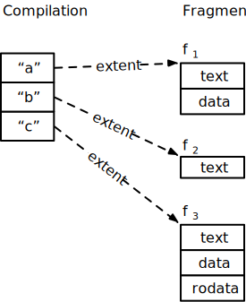
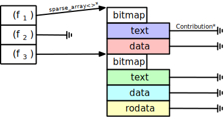
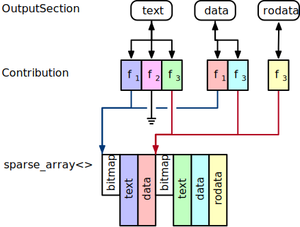
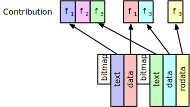
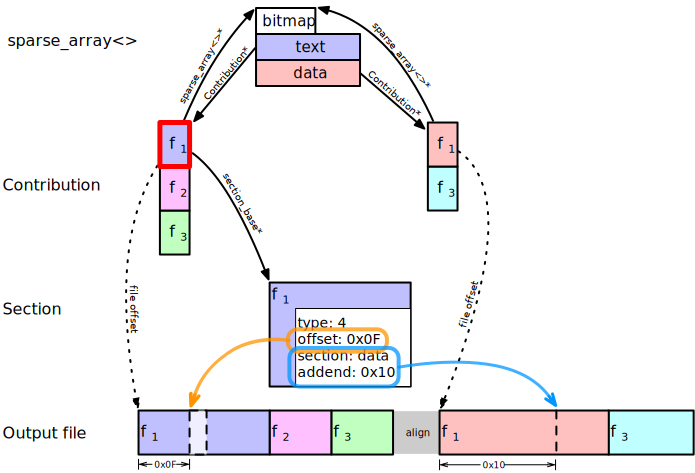

# Internal Fixups

* [Introduction](#introduction)
* [Internal Fixups in rld](#internal-fixups-in-rld)
    * [Database Representation](#database-representation)
    * [Scan](#scan)
    * [Layout](#layout)
        * [Contributions](#contributions)
        * [Follow the links](#follow-the-links)
    * [Copy](#copy)

## Introduction

The program repository uses “fixups” to express relationships between the sections of a single fragment and between different fragments. These are similar to the “relocations” used by other file formats such as ELF, Mach-O, or COFF. 

The program repository uses two different kinds of fixup: external and internal.

- “External” fixups [[glossary definition](https://github.com/SNSystems/llvm-project-prepo/wiki/Glossary#external-fixup)] are used for inter-fragment references. Each external fixup references the lowest-numbered section of a named fragment. The each fragment corresponding to that name is determined by linker’s [symbol resolution rules](https://github.com/SNSystems/llvm-project-prepo/wiki/%5Brld%5D-Symbol-resolution-rules).

- ”Internal” fixups [[glossary definition](https://github.com/SNSystems/llvm-project-prepo/wiki/Glossary#internal-fixup)] are intra-fragment references. They are used when data in one section of a fragment needs to reference data in a different section of the same fragment.

## Internal Fixups in rld

It’s easiest to discuss the way in which internal fixups are implemented in rld in the context of an example.

### Database Representation

We start with a single compilation containing three definitions (named “a”, “b” and “c”). 

| Name | Fragment      | Sections           |
|------+---------------+--------------------|
| a    | f1 | text, data         |
| b    | f2 | text               |
| c    | f3 | text, data, rodata |

The [fragment](https://codedocs.xyz/paulhuggett/pstore2/classpstore_1_1repo_1_1fragment.html) [[glossary](https://github.com/SNSystems/llvm-project-prepo/wiki/Glossary#fragment)] associated with each definition holds the sections shown in the diagram below. To hopefully make the diagrams below easier to follow, I have color-coded each of the sections [[glossary](https://github.com/SNSystems/llvm-project-prepo/wiki/Glossary#section)] associated with each of the three fragments (below).

(The [extent](https://codedocs.xyz/paulhuggett/pstore2/structpstore_1_1extent.html) type used to connect the definition to its fragment is how pstore describes the address and size of variable-length structures such as fragments. These dotted lines represent connections within the database address space, not heap pointers.)

### Scan

The linker’s “scan” tasks are primarily responsible for performing symbol resolution, but other work also happens here.

During symbol resolution we consider each definition and decide whether to create a new symbol or discard it according to the symbol resolution rules. We also connect external fixups to symbols.

For each retained definition with more than one section, a [pstore::sparse\_array<>](https://codedocs.xyz/paulhuggett/pstore2/classpstore_1_1sparse__array.html#details) is allocated where the available indices correspond to the fragment’s sections. That is, fragment f1 has text and data sections so we allocate a sparse array with two members; fragment f3 has text, data, and rodata so its sparse array has three members. f2 has only a single section so therefore has no internal fixups. This means that we do not need a corresponding sparse array for this fragment and its value is `nullptr` (as shown by the “earth ground” symbol ⏚).

At this stage, the value of each array member is `nullptr`.

Allocation for these structures comes from a per-thread [pstore::chunked_sequence<>](https://codedocs.xyz/paulhuggett/pstore2/classpstore_1_1chunked__sequence.html) instance which allows for fast, lock-free, allocation.

The scan phase yields a vector containing one `sparse_array<>` pointer for each retained definition per input compilation.

### Layout

The linker’s “layout” task is responsible for deciding where everything is placed in target memory. It is also partially responsible for the final layout within the output file; the precise position is format-dependent so the final decision is made by format-specific code.

Layout creates an instance of the `OutputSection` type for each distinct section type that will appear in the final output. In the case of this example, that is text, data, and rodata. It attaches each section that contributes to the output section via an instance of the `Contribution` type. The output sections know which contributions they each contain; each contribution knows which output sections to which it belongs.

#### Contributions

Contributions are an important data structure in layout. Each `Contribution` instance corresponds to a section of a fragment that will be copied to the output. It carries the information needed to place it correctly (on disk and in target memory) with the required alignment and to process its internal and external fixups.

#### Follow the links

As the contributions for each fragment are instantiated, we can point the fields of the `sparse_array<>` to the correct addresses.

(These diagrams are separated so that the links are somewhat easier to see: as a single diagram there are far too many arrows!)

In this way, it’s possible to follow the pointers from a `Contribution` to the other contributions from the same fragment. This is exactly the information that we need to apply internal fixups in the copy phase.

### Copy

The linker’s copy phase is the consumer of the data structures that we built in the earlier stages. It copies the section data to the final output file and, as such, it is responsible for applying both the external- and internal-fixups.

The algorithm simply enumerates the output sections and the contributions that each holds. As each `Contribution` is visited we perform a sequence of steps:

1. Copy the section payload to the output file.
1. Apply each of the external fixups associated with the section.
1. Apply each of the internal fixups associated with the section. For each internal fixup:

       - Compute the location at which the fixup action will be applied. This is the file offset of the section plus the value of fixup offset field.
       - Compute the value of the fixup. The specifics vary according to the fixup type field and its interpretation according to the appropriate ABI documentation, however we can think of this as using the target address of referenced section plus the addend value.

This diagram below focusses on fragment f1’s text section (highlighted with a thick red border), showing the section with a single internal fixup. The other sections have the same basic connections, but the representation of the section itself varies between sections (for example, BSS sections have only size and alignment).
    

We can derive the target address and output-file offset of the f1 text section from its `Contribution` record. The internal fixup in the diagram references the data section: we can derive the same for this section by dereferencing the `sparse_array<>`pointer from the text section’s contribution and accessing the data section’s entry in the array.