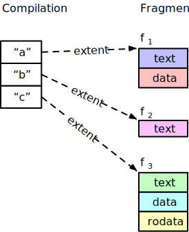
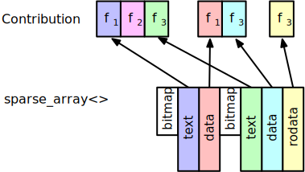
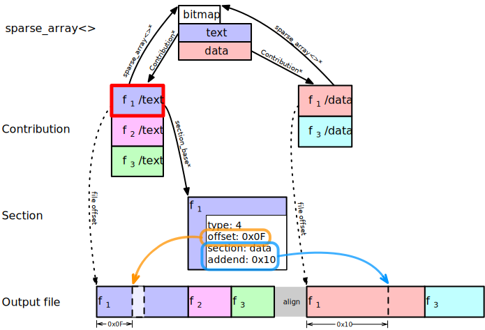

Internal Fixups in rld

The program respository uses “fixups” to express relationships between the sections of a single fragment and between different fragments. These are similar to the “relocations” used by other file formats such as ELF, Mach-O, or COFF.

The program respository uses two different kinds of fixup: external and internal. External fixups are used for a reference to a different fragment; internal fixups are used to refer to data in different sections within the same fragment.

## Example

### Database Representation

We start with a single compilation containing three definitions (named “a”, “b” and “c”). 

| Name | Fragment      | Sections           |
|------+---------------+--------------------|
| a    | f1 | text, data         |
| b    | f2 | text               |
| c    | f3 | text, data, rodata |

The fragment associated with each definition holds the sections shown in the diagram below. 

(The “extent” type used to connect the definition to its fragment is how pstore describes the address and size of variable-length structures such as fragments. These dotted lines represent connections within the database address space, not heap pointers.)

To make the diagrams below easier to follow, I have color-coded each of the sections associated with each of the three fragments (below).

### Scan

The linker’s “scan” phase is primarily responsible for performing symbol resolution, but other happen tasks here as well. During symbol resolution we consider each definition and decide whether to create a new symbol or discard it according to the [symbol resolution rules](https://github.com/SNSystems/llvm-project-prepo/wiki/%5Brld%5D-Symbol-resolution-rules). 

For each retained symbol with more than one section, a [pstore::sparse\_array<>](https://codedocs.xyz/paulhuggett/pstore2/classpstore_1_1repo_1_1sparse__array.html) is allocated where the available indices correspond to the fragment’s sections. That is, fragment f1 has text and data sections so we allocate a sparse array with two members; fragment f3 has text, data, and rodata so its sparse array has three members. f2 has only a single section so therefore has no internal fixups. This means that we do not need a corresponding sparse array for this fragment and its value is `nullptr` (as shown by the “ground” symbol).

At this stage, the value of each array member is `nullptr`.

### Layout

The linker’s “layout” thread is responsible for deciding where everything is placed in target memory. It is also partially responsible for the final layout within the output file; the precise position is format-dependent so the final decision is made by format-specific code.

Layout creates an instance of the `OutputSection` type for each section that will appear in the final output. It attaches each section that contributes to the output section via an instance of the `Contribution` type. The output sections know which contributions they each contain; each contribution knows which output sections to which it belongs.

As the contributions for each of a fragment’s sections are created, we are able to store a pointer to the sparse_array<> created in the previous step.

At the same time we can point the fields of the sparse_array<> to the corresponding contributions.

(These diagrams are separated so that the links are easy to see! As a single diagram there are far too many arrows.)

In this way, it’s possible to follow the pointers from a Contribution to the other contributions from the same fragment. This is exactly the information that we need to apply internal fixups in the copy phase.

### Copy

The linker’s copy phase is the consumer of the data stuctures that we built in the earlier stages. It copies the section data to the final output file and, as such, it is responsible for applying both the external- and internal-fixups.

In this diagram is focussed on fragment f1’s text section. The other sections have the same basic connections, but the representation of the section itself varies between sections (for example, BSS sections have only size and alignment).

When processing 
